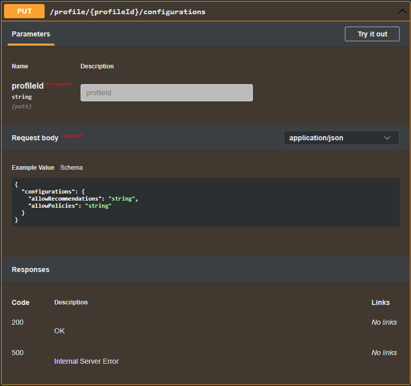
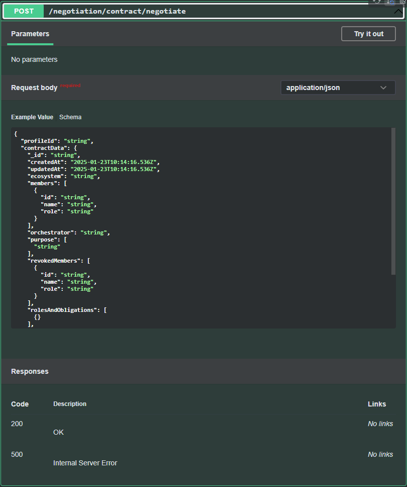
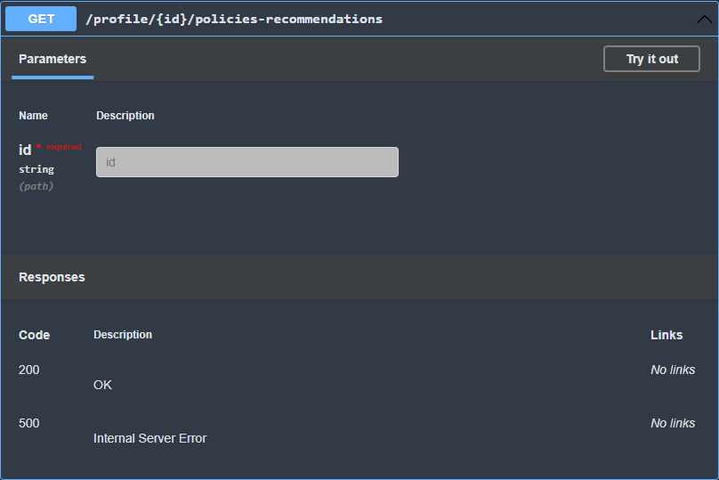

# Consent/Contracts Negotiating Agent

## Overview

The Consent/Contracts Agent is a comprehensive library designed to seamlessly integrate with the contract-manager and consent-manager. It offers a range of features, including the automatic creation and management of profiles, automation of processes, personalized recommendations, and the ability to set and manage profile preferences. Additionally, the agent provides a robust routing system to facilitate the efficient flow of these functionalities.

## Design Document
See the design document [here](docs/design-document.md).

## Features

- **Consent Profile Management**: Enables profiles for users in the consent-manager.
- **Contract Profile Management**: Enables profiles for contract-manager.
- **Contract Negotiation Management**: Enables organizations to define default rules and conditions for negotiation.

## Configuration instructions

### Example Configuration

Here’s an example of a JSON configuration:

```json
{
  "source": "profiles",
  "url": "mongodb://localhost:27017",
  "dbName": "contract_consent_agent_db",
  "watchChanges": false,
  "hostsProfiles": true,
  "existingDataCheck": true
}
```

See more [here](./contract-agent/README.md)

## Building instructions

To build le library you can use

`npm run build` 

## Running instructions
The contract/consent agent is a library, so you can't run it, but it's purpose it's to be installed and use in the contract-manager and consent-manager

### Consent integration step guide
1. Install the contract-consent-agent
```bash
npm install https://gitpkg.now.sh/Prometheus-X-association/contract-consent-agent/contract-agent?VERSION
```

2. Create the config file and add your information ([documentation](./contract-agent/README.md))

3. Initialise the library at your main.ts

```typescript
import express, { json as expressJson } from "express";
import { loadRoutes } from "./routes";
import path from "path";
import fs from "fs";

// Simulation
import { Agent, ConsentAgent } from "contract-agent";

export const startServer = async () => {

  const app = express();
  const port = testPort || process.env.PORT || 3000;

  //Consent Agent exemple setup
  const configFilePath = path.resolve(
    __dirname,
    agentConfigPath ?? "../consent-agent.config.json"
  );
  if (fs.existsSync(configFilePath)) {
    Agent.setConfigPath(
      agentConfigPath ?? "../consent-agent.config.json",
      __filename
    );
    Agent.setProfilesHost("profiles");
    await ConsentAgent.retrieveService();
  }

  loadRoutes(app);

  // Start the server
  const server = app.listen(port, () => {
    //eslint-disable-next-line
    console.log(`Consent manager running on: http://localhost:${port}`);
  });

  return { server, app }; // For tests
};

```
4. Add the needed router into your project router
```typescript
//router.ts
import { Application, Request, Response } from "express";

// Routes
import consentRouter from "./consent";
import { ConsentAgentRouter } from "contract-agent";

const API_PREFIX = process.env.API_PREFIX;

export const loadRoutes = (app: Application) => {
  app.get("/health", (req: Request, res: Response) => {
    res.json({ status: "OK" });
  });

  app.use(API_PREFIX + "/consents", consentRouter);
  app.use(API_PREFIX + "/", verifyUserJWT, ConsentAgentRouter);
};

```
## Technical Usage Scenarios

- Individuals can manage their consent preferences effectively.
- Organizations can streamline the negotiation process for data sharing agreements.
- Automatic recommendations for services based on consent profiles and contract profiles.

## API Documentation

The API for the Consent/Contracts Negotiating Agent is documented using Swagger. You can find the API routes and their descriptions in the `swagger.json` file located in the `contract-agent/docs` directory.

You can use the following command to generate the swagger.json

```bash
npm run swagger
```
### Example API Endpoints

- **Get data exchanges recommendations**: `GET /profile/{profileId}/recommendations/consent`
- **Set Preferences**: `POST /profile/{profileId}/preferences`
- **Get Preferences**: `GET /profile/{profileId}/preferences`
- **Negotiate Contract**: `POST /negotiation/contract/negotiate`

### Example usage

Send the following requests to the designated endpoints:





## Integrations

### Direct Integrations with Other Building Blocks

- [Consent Manager](https://github.com/Prometheus-X-association/consent-manager)
- [Contract Manager](https://github.com/Prometheus-X-association/contract-manager)

### Standards

- **Data Format Standards**: JSON-LD, ISO 3166-1 alpha-2, ISO 8601, ODRL

## Architecture

The architecture consists of several key components:

1. **Contract Agent**: Manages contract profiles of organizations and facilitates contract negotiations.
2. **Consent Agent**: Manages consent preferences of individuals and automates responses to consent requests.

## Logging and Operations

The agent logs operations, errors, and warnings to facilitate troubleshooting and debugging. It also imposes limits and usage constraints to ensure efficient operation.

## Testing and instructions

The testing strategy includes unit tests, integration tests, and UI tests to ensure the correctness and reliability of functionalities.

### Contract Agent

> Before running the contract agent test you will need to run a local mongodb database and then running the seed command.

```bash
pnpm seed
```

```bash
pnpm test-cca-contract
```

### Consent Agent
> For the consent agent test, mongodb is mocked so no local database is required to run the following command:
```bash
pnpm test-cca-consent
```

## Generate Test Reports Independently by Agent

> for running this command it's necessary to install de dependancy inside the contract-agent directory using
> ```bash
> pnpm install
> ```
> 

### Contract Agent
```bash
pnpm report-cca-contract
```

### Consent Agent
```bash
pnpm report-cca-consent
```

## Run Full Test Suite
```bash
pnpm test
```

See more [here](./contract-agent/README.md) for instructions.

## Usage in the Dataspace

The Consent/Contracts Negotiating Agent enhances data usage and sharing agreements management, ensuring compliance with policies and streamlining processes for individuals and organizations.

## License

This project is licensed under the MIT License.

## Contributing

Contributions are welcome! Please submit a pull request or open an issue for any enhancements or bug fixes.

## Contact
For more information, please contact the project maintainers.