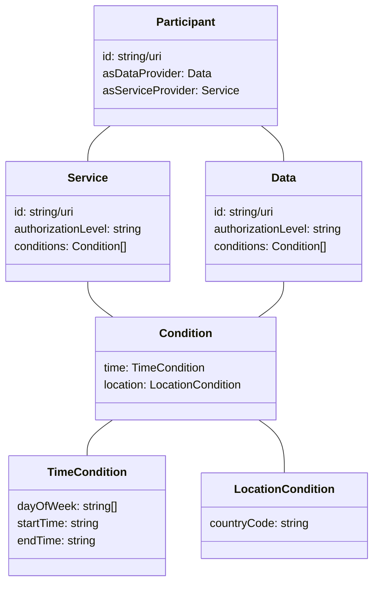
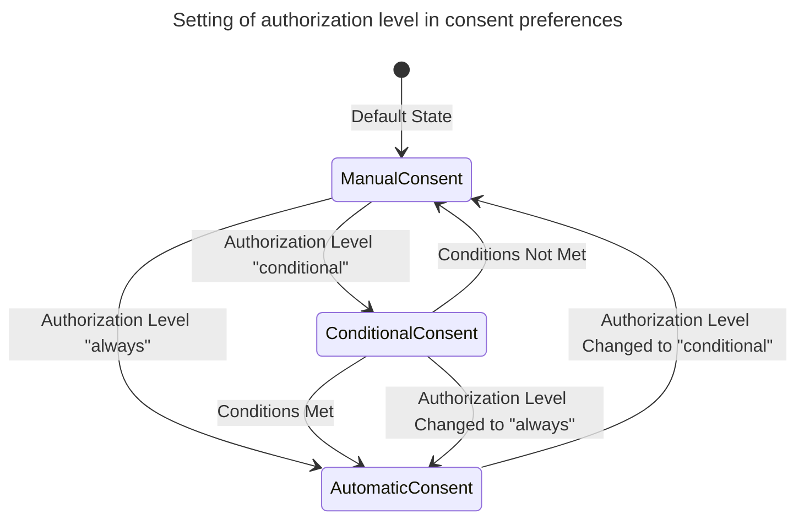

# Consent / Contract Negotiating Agent

The Consent/Contracts Negotiating Agent streamlines the process for individuals to set consent preferences regarding data usage, automates responses to consent requests from managers, and matches individuals with relevant services based on their consent profiles. 

Its components encompass consent preference settings, service matching capabilities, communication with consent managers, and the provision for organizations to define default rules and conditions for contractual agreements.

## Technical usage scenarios & Features

The Consent/Contracts Negotiating Agent empowers individuals and data providers to manage consent preferences and discover suitable services within dataspace ecosystems. It facilitates automatic matching and recommendation processes based on an individual's consent profile and organizations' data sharing agreements.

### Features/main functionalities

- Empowers individuals to set consent preferences for data usage.
- Automatic matching and recommendation process based on consent profiles and data sharing agreements.
- Communication with consent managers to handle consent requests and responses.
- Integration with dataspace ecosystems to ensure compatibility with ecosystem conditions.
- Provision for organizations to define default rules and conditions for contractual agreements.

### Technical usage scenarios

- Enable individuals to manage their consent preferences efficiently and effectively.
- Facilitate automatic matching of individuals' consent profiles with the conditions of dataspace ecosystems.
- Recommend the best services to individuals based on their needs and the permissibility of the data.
- Streamline the process of handling consent requests and responses between individuals and consent managers.
- Provide organizations with the capability to establish default rules and conditions for contractual agreements, ensuring compliance and consistency.

## Requirements

* MUST enable individuals to set and manage consent preferences for data usage.
* MUST facilitate automatic matching and recommendation processes based on consent profiles and organizations' data sharing agreements.
* MUST communicate effectively with consent managers to handle consent requests and responses.
* MUST integrate seamlessly with dataspace ecosystems to ensure compatibility with ecosystem conditions.
* MUST provide configuration options for organizations to define default rules and conditions for contractual agreements.
* MUST be able to process both bilateral and data space use case data sharing agreements.

## Integrations

_See "01_BB Connections" spreadsheet_

### Direct Integrations with Other BBs

#### Core Building Blocks
Interaction with other building blocks are essential to ensuring the functionalities of Consent / Contract Negotiating Agent as it needs to be able to read from consents and contracts, as well as read information from the catalogue.
- [Consent](https://github.com/Prometheus-X-association/consent-manager)
- [Contract](https://github.com/Prometheus-X-association/contract-manager)
- [Catalogue](https://github.com/Prometheus-X-association/catalog-api)

#### Other Building Blocks

### Integrations via Connector

This building block is not aimed to have a connector integration as it will be intimitely linked to the Consent and Contract building blocks which exist outside of the connector.

It will however be a source of data exchange trigger which will enable the Consent service to notify the connectors of the data exchange following the protocol defined in the consent building block.

## Relevant Standards

### Data Format Standards

- [JSON-LD](https://json-ld.org/)
- [ISO 3166-1 alpha-2](https://en.wikipedia.org/wiki/ISO_3166-1_alpha-2) for location country codes
- [ISO 8601](https://en.wikipedia.org/wiki/ISO_8601) for Date and time format

### Mapping to Data Space Reference Architecture Models

_Mapping to [DSSC](https://dssc.eu/space/DDP/117211137/DSSC+Delivery+Plan+-+Summary+of+assets+publication) or [IDS RAM](https://docs.internationaldataspaces.org/ids-knowledgebase/v/ids-ram-4/)_

## Input / Output Data

This Building Block reads from existing contracts generated by the [Contract](https://github.com/Prometheus-X-association/contract-manager) building block and existing consent from the [Consent](https://github.com/Prometheus-X-association/consent-manager) building block.

### Consent preferences

Entities in the consent preferences are defined by the following UML diagram

User input will allow setting the consent profile preferences. An example of a simple consent profile would follow the following structure:

### TODO Matching

## Architecture

_What components make up this BB?
If applicable, insert a simple figure, eg a UML class diagram.
What is the purpose of the components and what are their relationships?_

## Dynamic Behaviour

The sequence diagram shows how the component communicates with other components.

TODO

This statechart shows the internal state changes of the component.

## Configuration and deployment settings

_What configuration options does this BB have?
What is the configuration format?
Provide examples.
How is the component logging the operations? What are the error scenarios? What are the limits in terms of usage (e.g. number of requests, size of dataset, etc.)?_

## OpenAPI Specification

_TODO When ready._

## Test specification

_Test definitions and testing environment should be availaible, and the tests should be repeatable._

### Test plan
_Testing strategy, tools and methods chosen, methods for acceptance criteria.
To be detailed._

### Unit tests

_Here specify the test cases for the components inside the BB.  
Candidates for tools that can be used to implement the test cases: JUnit, Mockito, Pytest._

### Integration tests

_Here specify how to test the integration of the components inside the BB.  
Candidates for tools that can be used to implement the test cases: K6, Postman, stepci, Pact  
An example tutorial is available [here](https://github.com/ftsrg-edu/swsv-labs/wiki/2b-Integration-testing)._

### UI test (where relevant)

_To be defined_