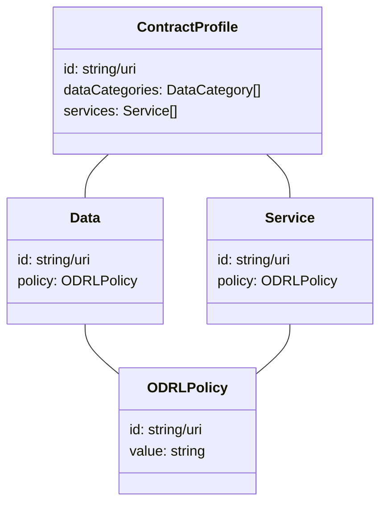
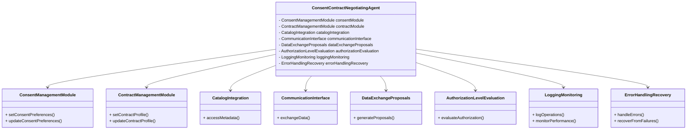
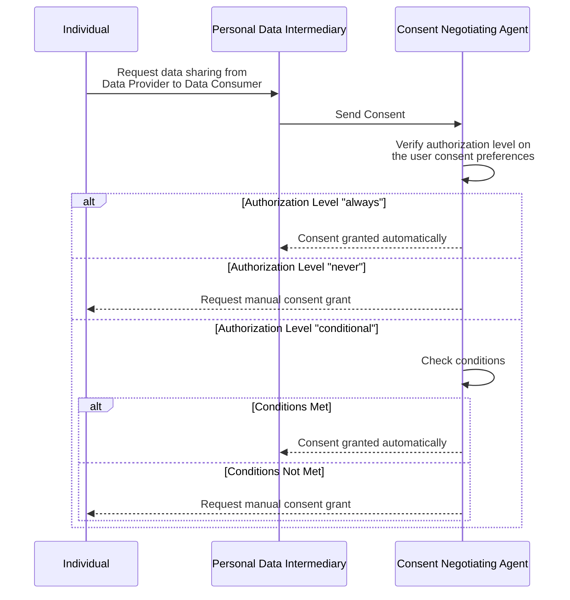
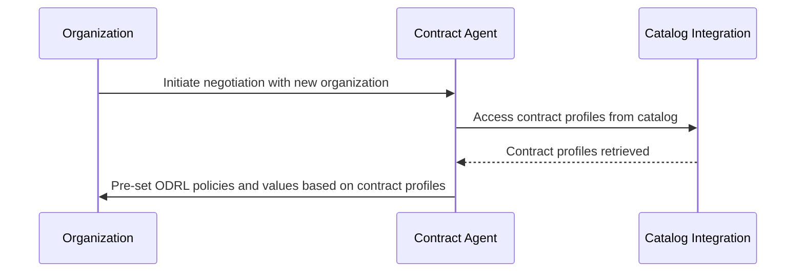
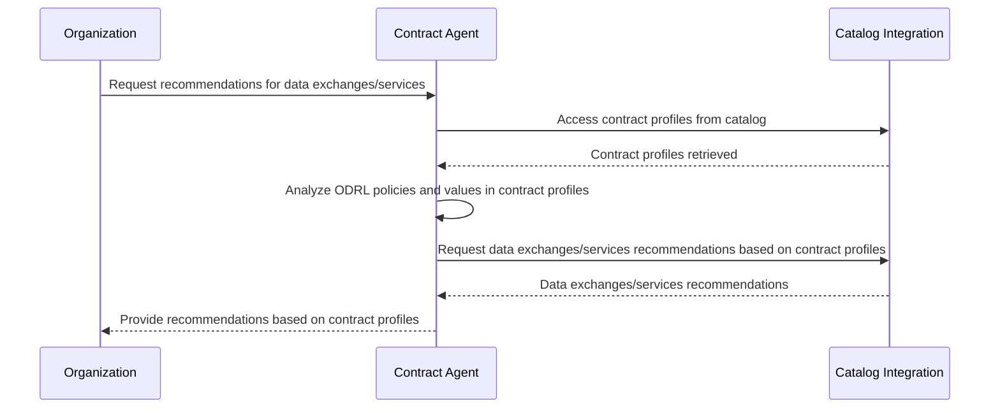

# Consent / Contract Negotiating Agent

The Consent/Contracts Negotiating Agent streamlines the process for individuals to set consent preferences regarding data usage, automates responses to consent requests from managers, and matches individuals with relevant services based on their consent profiles. Additionally, it assists organizations in negotiating and managing contractual agreements for data sharing within the dataspace ecosystem.

Its components encompass consent preference settings, service matching capabilities, communication with consent managers, contract profile management, and the provision for organizations to define default rules and conditions for contractual agreements.

## Technical usage scenarios & Features

The Consent/Contracts Negotiating Agent empowers individuals and data providers to manage consent preferences, discover suitable services, and negotiate data sharing agreements within dataspace ecosystems. It facilitates automatic matching and recommendation processes based on an individual's consent profile and organizations' data sharing agreements.

### Features/main functionalities

- Empowers individuals to set consent preferences for data usage.
- Automatic matching and recommendation process based on consent profiles and data sharing agreements.
- Communication with consent managers to handle consent requests and responses.
- Integration with dataspace ecosystems to ensure compatibility with ecosystem conditions.
- Provision for organizations to define default rules and conditions for contractual agreements.

### Technical usage scenarios

- Enable individuals to manage their consent preferences efficiently and effectively.
- Facilitate automatic matching of individuals' consent profiles with the conditions of dataspace ecosystems.
- Recommend the best services to individuals based on their needs and the permissibility of the data.
- Streamline the process of handling consent requests and responses between individuals and consent managers.
- Provide organizations with the capability to establish default rules and conditions for contractual agreements, ensuring compliance and consistency.

## Requirements

* MUST enable individuals to set and manage consent preferences for data usage.
* MUST facilitate automatic matching and recommendation processes based on consent profiles and organizations' data sharing agreements.
* MUST communicate effectively with consent managers to handle consent requests and responses.
* MUST integrate seamlessly with dataspace ecosystems to ensure compatibility with ecosystem conditions.
* MUST provide configuration options for organizations to define default rules and conditions for contractual agreements.
* SHOULD be able to process both bilateral and data space use case data sharing agreements.

## Integrations

### Direct Integrations with Other BBs

#### Core Building Blocks
Interaction with other building blocks are essential to ensuring the functionalities of Consent / Contract Negotiating Agent as it needs to be able to read from consents and contracts, as well as read information from the catalogue.
- [Consent](https://github.com/Prometheus-X-association/consent-manager)
- [Contract](https://github.com/Prometheus-X-association/contract-manager)
- [Catalogue](https://github.com/Prometheus-X-association/catalog-api)

#### Other Building Blocks

~

### Integrations via Connector

This building block is not aimed to have a connector integration as it will be intimitely linked to the Consent and Contract building blocks which exist outside of the connector.

It will however be a source of data exchange trigger which will enable the Consent service to notify the connectors of the data exchange following the protocol defined in the consent building block.

## Relevant Standards

### Data Format Standards

- [JSON-LD](https://json-ld.org/) for schema definitions
- [ISO 3166-1 alpha-2](https://en.wikipedia.org/wiki/ISO_3166-1_alpha-2) for location country codes
- [ISO 8601](https://en.wikipedia.org/wiki/ISO_8601) for Date and time format
- [ODRL](https://www.w3.org/TR/odrl-model/) for contract policies

## Input / Output Data

This Building Block reads from existing contracts generated by the [Contract](https://github.com/Prometheus-X-association/contract-manager) building block and existing consent from the [Consent](https://github.com/Prometheus-X-association/consent-manager) building block.

## Consent preferences

Entities in the consent preferences are defined by the following UML diagram

User input will allow setting the consent profile preferences. An example of a simple consent profile would follow the following structure:

## Contract Profiles

For organizations within the dataspace, they are subject to negotiate and contractualise for the usage of their data or services under a certain set of ODRL policies. The contract profile and agent would enable a streamlined experience in setting up ODRL policies and their values when negotiating with new organisations if similar data or services has been configured within the contract profile.

Organizations can create a contract profile where they define various data categories and services they offer or utilize. For each data category and service, organizations specify the corresponding ODRL policies, including permissions, prohibitions, obligations, and constraints. When negotiating with new organizations or entities, the contract negotiating agent leverages these pre-configured contract profiles. It identifies similarities between the data categories and services involved, utilizing existing policies and values whenever possible to expedite the negotiation process. This approach not only accelerates negotiation but also ensures consistency and compliance across contractual agreements within the dataspace ecosystem.

## Matching

### Consent Matching
The consent negotiating agent interacts with the catalog to identify similar types of data and services based on individuals' consent preferences. By analyzing consent profiles, the agent discerns the authorization levels, conditions, and preferences set by individuals regarding data usage.

Leveraging this information, it proposes potential data exchanges to individuals, recommending suitable data sources or services that align with their consent preferences. This process ensures that individuals have access to relevant and permissible data within the dataspace.

### Contract Matching
The contract negotiating agent utilizes the catalog to identify comparable data categories and services based on organizations' contract profiles. By examining the ODRL policies and values specified in the contract profiles, the agent identifies relevant organizations and datasets that align with the contractual agreements and obligations defined by the organizations.

It then proposes potential partners or datasets to organizations, facilitating streamlined negotiations and partnerships within the dataspace.

This approach enables organizations to efficiently discover and engage with compatible partners and datasets, optimizing data sharing and utilization while ensuring adherence to contractual agreements and regulatory requirements.

## Architecture

1. **Negotiating Agents**: The core components responsible for managing consent and contract negotiations. These agents communicate with individuals, organizations, and the catalog to gather and analyze consent preferences and contract profiles.
2. **Catalog Integration**: Integration with the catalog system to access metadata about available data sources, services, and organizations within the dataspace. This integration enables the negotiating agents to identify relevant data and services based on consent preferences and contract profiles.
3. **Consent Management Module**: A module responsible for managing consent preferences of individuals. It allows individuals to set and update their consent preferences, including authorization levels and conditions for data uage.
4. **Contract Management Module**: A module dedicated to managing contract profiles of organizations. It enables organizations to define ODRL policies and values for data categories and services, facilitating streamlined negotiations with potential partners.
5. **Communication Interface**: An interface for communication between the negotiating agents, individuals, organizations and the catalog. This interface ensures seamless exchange of consent preferences, contract profiles, and negotiation proposals.
6. **Data Exchange Proposals**: Components responsible for generating data exchange proposals for individuals based on their consent preferences and for proposing relevant organizations or datasets to organizations based on their contract profiles.
7. **Authorization Level Evaluation**: Components for evaluating authorization levels and conditions specified in consent preferences and contract profiles. These components determine the permissibility of data exchanges and partnerships.
8. **Logging**: Mechanisms for logging operations and monitoring the performance of the agents and related components.
9. **Error Handling & Recovery**: Strategies and mechanisms for handling errors and recovering from failures gracefully.

## Dynamic Behaviour

This statechart shows the internal state changes of the component.

***

### Communication with other components

#### Verification of consent preferences to automate consent grant

#### Streamlining Negotiation Process

#### Recommendations of Data Exchanges

## Configuration and deployment settings
### Logging and Operations
The Consent/Contracts Negotiating Agent logs operations, errors, and warnings to designated log files. Logging includes details such as consent requests, contract negotiations, integration errors, and system status updates. Error scenarios, such as failed consent requests or contract validation errors, are logged with appropriate error codes and descriptions to aid in troubleshooting and debugging.

### Limits and Usage Constraints
The Consent/Contracts Negotiating Agent imposes certain limits and usage constraints to ensure efficient operation and resource allocation within the dataspace ecosystem. These limits may include maximum concurrent requests, maximum dataset size for contract profiles, and rate limiting for API calls to external systems. Additionally, the agent may enforce authentication and access control mechanisms to protect sensitive data and ensure compliance with regulatory requirements. Configuration options for these limits and constraints can be adjusted based on deployment requirements and scalability considerations.

## OpenAPI Specification

_TODO When ready._

## Test specification

### Test plan
The testing strategy for the Consent/Contracts Negotiating Agent will focus on ensuring the correctness, reliability, and performance of its functionalities. We will employ a combination of unit tests, integration tests, and possibly UI tests where relevant. The testing environment will replicate production-like conditions to validate the agent's behavior accurately. Acceptance criteria will be defined based on user stories, functional requirements, and performance benchmarks.

### Unit tests

For unit testing, we will utilize the Mocha testing framework along with Chai for assertions. The test cases will cover individual components and modules of the Consent/Contracts Negotiating Agent, including consent management, contract profile management, catalog integration, communication interface, and data exchange proposals. Mocking frameworks like Sinon may be used to isolate dependencies and simulate external interactions.

### Integration tests

Integration tests will focus on validating the interaction between different components of the Consent/Contracts Negotiating Agent. We will use tools such as Postman for API testing to verify communication interfaces and data exchange protocols. Additionally, integration tests will ensure seamless integration with external systems like consent managers and catalog APIs. Continuous Integration (CI) pipelines will be set up to automate the execution of integration tests.

### UI test

UI tests will be defined for any user interfaces or administrative dashboards provided by the Consent/Contracts Negotiating Agent. Testing frameworks like Cypress will be used to automate UI interactions and validate the usability and functionality of the user interface. UI tests will cover scenarios such as consent preference settings, contract profile management, and error handling.